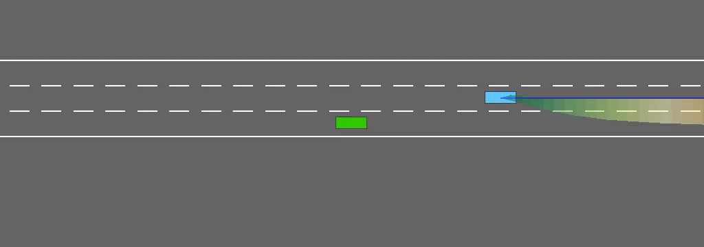

## Abstract

The problem of behaviour prediction for linear parameter-varying systems is considered in the interval framework. It is assumed that the system is subject to uncertain inputs and the vector of scheduling parameters is unmeasurable, but all uncertainties take values in a given admissible set. Then an interval predictor is designed and its stability is guaranteed applying Lyapunov function with a novel structure. The conditions of stability are formulated in the form of linear matrix inequalities. Efficiency of the theoretical results is demonstrated in the application to safe motion planning for autonomous vehicles.

## Experiments

The performances of a baseline interval predictor and our novel predictor are compared on a [simulated driving environment](https://github.com/eleurent/highway-env).

### Direct Interval Predictor


When using interval arithmetic to design a simple predictor, the predictor dynamics are unstable. The uncertainty quickly builds up until the trajectory interval covers the entire road, even through the original system dynamics are stable. This seriously hinders decision-making.

### Novel Interval Predictor


Conversely, the novel interval predictor has stable dynamics which enables safe planning over long-term horizons.

### Right-Hand Traffic


In a right-hand traffic model, we can reasonably assume that vehicles tend to return to the rightmost way, but won't switch to the left lane for no reason (e.g. a slow obstacle in front). When incorporating this assumption in the interval predictor, the resulting robust policy won't pass a leading vehicle on the right, and can only overtake from the left.



This behaviour is consistent with the traffic rules and emerges from safe decision-making under uncertainty, instead of being enforced explicitely through a specific penalty in the objective function.

### Dense Traffic


In these simulations, several traffic participants are interacting with each other. The interval predictor scales linearly to large systems and time-horizons.


Other examples: [🎞️](assets/traf3.gif) [🎞️](assets/traf4.gif)

### Dense Right-Hand Traffic


Contrary to the previous dense traffic simulation, with the right-hand traffic modeling assumption the ego-vehicle never passes other vehicles on the right.


Other examples: [🎞️](assets/rht3.gif) [🎞️](assets/rht4.gif) [🎞️](assets/rht5.gif)

## Source code

### Install requirements

* The environment: [highway-env](https://github.com/eleurent/highway-env)
* The agents: [rl-agents](https://github.com/eleurent/rl-agents)

### Interval predictor implementation

* [Generic predictor](https://github.com/eleurent/highway-env/blob/master/highway_env/interval.py#L171)
* [Traffic LPV system](https://github.com/eleurent/highway-env/blob/master/highway_env/vehicle/uncertainty.py#L199)

### Run a robust planner

```shell
cd <path-to-rl-agents>/scripts/
python experiments.py evaluate configs/HighwayEnv/env.json \
                               configs/HighwayEnv/agents/IntervalRobustPlannerAgent/baseline.json \
                               --test --episodes=1
```
